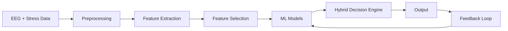

# 🧠 Cognitive Stress-Aware Epilepsy Classification System

### 🔬 Multimodal Machine Learning Framework for Seizure Prediction

---

## 🚀 Overview

This project presents a **multimodal machine learning system** that enhances epilepsy classification by integrating:

* 🧠 EEG (brain signals)
* ❤️ HRV (heart rate variability)
* ⚡ GSR (skin response)
* 🧩 Cognitive inputs

Unlike traditional systems, this approach considers **both neural activity and stress factors**, enabling more **accurate, reliable, and personalized predictions**.

---

## 🎯 Key Highlights

✨ Multimodal data fusion (EEG + stress indicators)
✨ Hybrid decision model (brain + cognitive signals)
✨ Advanced ML models (SVM, CNN, LSTM, TinyML)
✨ Real-time capable & deployable on edge devices
✨ Personalized seizure prediction

---

## 🧩 System Architecture



---

## ⚙️ Tech Stack

### 🧠 Machine Learning

* Python
* Scikit-learn
* TensorFlow / PyTorch

### 📊 Data Processing

* NumPy
* Pandas
* Signal Processing (FFT, DWT)

### 🌐 Backend

* FastAPI

### 💻 Frontend

* Next.js

### 🗄 Database

* MongoDB

---

## 🔄 Workflow

1️⃣ Data Collection (EEG + HRV + GSR)
2️⃣ Signal Preprocessing (Filtering, Normalization)
3️⃣ Feature Extraction (FFT, DWT, Frequency Bands)
4️⃣ Feature Selection (PCA, RFE)
5️⃣ Model Training (SVM, CNN, LSTM)
6️⃣ Hybrid Decision Making
7️⃣ Output Generation
8️⃣ Continuous Learning (Feedback Loop)

---

## 📊 Model Performance

| Model           | Accuracy  | Precision | Recall    | F1 Score  |
| --------------- | --------- | --------- | --------- | --------- |
| SVM             | 91.2%     | 90.4%     | 89.7%     | 89.9%     |
| CNN             | 95.6%     | 94.8%     | 95.1%     | 95.0%     |
| 🔥 Hybrid Model | **98.3%** | **98.1%** | **97.9%** | **98.0%** |

---

## ⚡ Advantages

✅ Higher accuracy than EEG-only systems
✅ Considers real-world stress triggers
✅ Reduced false predictions
✅ Personalized patient monitoring
✅ Suitable for wearable devices

---

## 🧪 Installation

```bash
# Clone repo
git clone https://github.com/your-username/your-repo-name.git

# Navigate
cd your-repo-name

# Install dependencies
pip install -r requirements.txt
```

---

## ▶️ Run Project

```bash
# Backend
uvicorn main:app --reload

# Frontend
npm run dev
```

---

## 📂 Project Structure

```
├── backend/
│   ├── models/
│   ├── routers/
│   ├── utils/
│
├── frontend/
│   ├── components/
│   ├── pages/
│
├── data/
├── notebooks/
├── README.md
```

---

## 🔮 Future Scope

* Real-time wearable integration
* Mobile app deployment
* Explainable AI (XAI) for interpretability
* Clinical validation

---

## 👨‍💻 Authors

* Shourish Paul
* Steve Thomas
* Suman Kumar
* Harsh Anand

---

## 📜 License

This project is for academic and research purposes.

---

## ⭐ Support

If you like this project:

🌟 Star the repo
🍴 Fork it
📢 Share it

---
